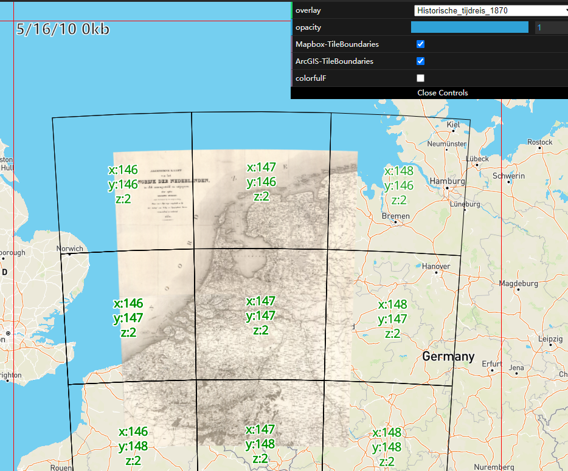

# Mapbox Raster Reprojection Layer

A client-side raster reprojection layer from non-mercator projections to mercator projection.

Like [OpenLayers Raster Reprojection](https://openlayers.org/en/latest/examples/reprojection.html).

Online Demo [codesandbox](https://codesandbox.io/p/github/BranZhang/Mapbox-Raster-Reprojection-Layer/master?file=%2Fsrc%2Findex.js)




## API

```javascript
const reprojectionSource = new ReprojectionSource(map, options);
```

### ReprojectionSource

| name    | type         | Description           |
|---------|--------------|-----------------------|
| map`Required`     | `Mapbox Map` | A Mapbox Map object.  |
| options`Required` | `Options`    | Reprojection options. |

### Options

| name                | type         | Description                                         |
|---------------------|--------------|-----------------------------------------------------|
| wmtsText`Required`  | `Mapbox Map` | wmts config file in xml format.                     |
| converter`Required` | `object`     | An object with `forward` and `inverse` function.    |
| layer               | `object`     | Reprojection options, default first layer.          |
| matrixSet           | `string`     | The matrix set identifier, default first matrixSet. |
| style               | `string`     | The name of the style, default first style.         |
| tileSize            | `number`     | Mapbox raster source tileSize, default 512.         |
| division            | `number`     | Number of division per side of bounds, default 4.   |
| maxCanvas           | `number`     | max canvas usage, default 2.                        |

## Examples

```javascript
proj4.defs([
    [
        'EPSG:4326',
        '+title=WGS 84 (long/lat) +proj=longlat +ellps=WGS84 +datum=WGS84 +units=degrees'
    ],
    [
        'EPSG:27700',
        '+proj=tmerc +lat_0=49 +lon_0=-2 +k=0.9996012717 ' +
        '+x_0=400000 +y_0=-100000 +ellps=airy ' +
        '+towgs84=446.448,-125.157,542.06,0.15,0.247,0.842,-20.489 ' +
        '+units=m +no_defs'
    ]
]);

fetch('https://tiles.arcgis.com/tiles/qHLhLQrcvEnxjtPr/arcgis/rest/services/OS_Open_Raster/MapServer/WMTS')
    .then(function (response) {
        return response.text();
    })
    .then(function (text) {
        customSource = new CustomSource(map, {
            wmtsText: text,
            converter: proj4('WGS84', 'EPSG:27700'),
            layer: 'OS_Open_Raster', // Optional
            tileSize: 512, // Optional
            division: 4, // Optional
        });

        map.addSource('custom-source', customSource);
        map.addLayer({
            id: 'custom-source-layer',
            type: 'raster',
            source: 'custom-source',
            paint: {
                'raster-opacity': 1
            }
        });
    });
```

## Problems

1. Each custom Source uses 2 canvas, if you create multi layers, may cause 'Oldest context will be lost' error. Because browser has a limitation about how many canvas with 3D context are on 1 page. (All Reprojection Custom Sources share canvas will fix this.)
2. Some projections are not supported yet.
3. 1 pixel at each tiles edge is dropped for preventing flashing seams, a better solution is copying edge pixels out to a 1px border like Mapbox.
4. May require some 404 tiles.